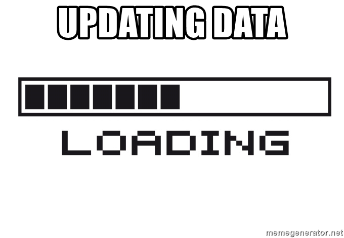

```{r xaringan-themer, include = FALSE}
library(xaringanthemer)
mono_accent(
  base_color = "#23395b",
  # primary_color = "#1F4257",
  # secondary_color = "#F97B64",
  # base_color = "#1F4257",
  header_font_google = google_font("Indie Flower"),
  text_font_size = "24px",
  text_font_google   = google_font("Tajawal", "300", "300i"),
  text_bold_color = "#F97B64",
  code_font_google   = google_font("Roboto Mono"),
  code_font_size = "0.8em",
  extra_css = list(
    ".remark-slide-content h1, h2, h3" = list(
      "margin-top" = "10px",
      "margin-bottom" = "20px"
      )
    )
)
```

```{r setup, include=FALSE}
options(htmltools.dir.version = FALSE)
knitr::opts_chunk$set(warning = FALSE,
                      error = FALSE,
                      message = FALSE,
                      echo = FALSE,
                      fig.align = "center",
                      comment="")
library(knitr)
library(fontawesome)
```

# 1. Introdução

```{r}

```


---
## Quem sou eu

#### Bruno Pinheiro de Oliveira

Pai do Iriê.

Sou cientista de dados na unidade de produtos financeiros da Stone, onde trabalho com modelagem de crédito.

Adoro fuçar sobre o mundo numa boa base de dados (e às vezes penar para construir uma).


Ah! Estudo Gestão de Políticas Públicas na EACH/USP.


---
## A atividade

.pull-left[
### Dia 1

- Contexto
- Conhecendo o R
- Interface do R
- Caso: Análise de dados culturais
- Tipos e estruturas de dados
    + Tipos de dados
    + Estruturas de dados no R
    + Formatos
- Operações básicas
- Análises Univariadas
- Criando um mapa
]

.pull-right[

### Dia 2

Manipulação de dados com `dplyr` e `sf`. Gráficos com `ggplot`. Mapas. Caso - continuação da análise de dados culturais

### Dia 3

Encontrando padrões: árvores de decisão, clusterização. Caso - distribuição dos votos em São Paulo.

### Dia 4
Encontrando padrões 2: Caso - distribuição de equipamentos culturais e eleições
]

---
class: inverse, middle, center

## Contexto

---
## O papel do uso de dados na gestão pública

- Controle social e combate à corrupção `r fa("check", fill = "#F97B64")`

- Maior confiança nas instituições `r fa("check", fill = "#F97B64")`

- Democracia `r fa("check", fill = "#F97B64")`

- Gestão mais eficiente `r fa("check", fill = "#F97B64")`

- Inovação em serviços `r fa("check", fill = "#F97B64")`

> #### "Não se trata mais apenas de disponibilizar as informações, mas de fazê-lo com objetivo de ampliar seu uso e de obter novas aplicações para além da simples prestação  de contas".
> Matheus, R; Vaz, J. C; Ribeiro, M (2013)

---
class: inverse, center, middle

`r fa("info-circle", fill = "#FFFFFF", height = "80px")`

#### O ESTADO É UM GRANDO ACUMULADOR DE DADOS COM OBRIGAÇÃO DE FORNECÊ-LAS (E USÁ-LAS?)

---
## Bases legais

#### __Lei 12.527, de 18 de novembro de 2011__

É conhecida como LAI - Lei de Acesso à Informação e regula os aspectos relativos no art. 5º da Constituição Federal. Estabelece a transparência como regra e o sigilo como exceção.

#### Transparência ativa

Acontece quando o poder público disponibiliza seus dados e informações de forma proativa.

#### Transparência passiva

Quando os dados não estão disponibilizados, os cidadãos podem requisitá-los ao poder público realizando pedidos de acesso à informação

---
## O que é ciência de dados

.pull-left[
* Resolução de problemas complexos a partir de dados
* Criação de produtos a partir de dados
* Big data, machine learning, inteligência artificial...
* ...

Ciência de dados é um campo interdisciplinar que visa __descobrir o que fazer com a galáxia de dados que existe e é produzida atualmente__, mirando desenvolver produtos de dados que respondam a demandas relacionadas à resolução de problemas.

* Problema nº 1: os dados (como obter, como armazenar, como acessar, como manter, como usar)
]

.pull-right[
```{r, out.width="500px", fig.align="center"}

```
]

---
## Data science pipeline na gestão pública

```{r, out.width="600px", fig.align="center"}

```

---
class: center, middle, inverse

# Casos de uso de dados governamentais

---
## Operação Serenata de Amor

.pull-left[
```{r, out.width="300px", fig.align="center"}

```

__Realização__: Operação Serenata de Amor 

__Dados usados__: [Cota para Exercício da Atividade Parlamentar](https://dadosabertos.camara.leg.br/swagger/api.html#staticfile)
]

.pull-right[
A [Operação Serenata de Amor](https://serenata.ai) é um projeto aberto que usa ciência de dados com a finalidade de fiscalizar gastos públicos e compartilhar as informações de forma acessível a qualquer pessoa.

A Serenata criou a [Rosie](https://twitter.com/rosiedaserenata), uma inteligência artificial capaz de analisar os gastos reembolsados pela Cota para Exercício da Atividade Parlamentar (CEAP), de deputados federais e senadores, feitos em exercício de sua função, identificando suspeitas e incentivando a população a questioná-los.
]

---
## Cuidando do meu bairro

.pull-left[
```{r, out.width="225px", fig.align="center"}

```

__Realização__: Co:laboratório de Desenvolvimento e Participação (COLAB) e parceiros

__Dados usados__: Secretaria da Fazenda - Execução Orçamentária, E-Negócios CidadeSP - Licitações e Contratos, ComprasNet - ata do pregão e outros
]

.pull-right[
Mapeia o orçamento público do município de São Paulo em tempo real. As despesas são georreferenciadas e classificadas conforme a etapa de execução (planejamento, empenho e liquidação).

Cada ponto no mapa contem informações sobre a despesa, que facilitam o controle das ações do poder público pela população. Além disso, é integrado ao e-SIC da Prefeitura. As perguntas que os cidadãos fazem na plataforma para os órgãos responsáveis pelas despesas são efetivados como pedidos de acesso à informação.
]

---
## Aqui tem remédio

.pull-left[
```{r, out.width="300px", fig.align="center"}

```


__Realização__: Secretaria de Saúde - Prefeitura de São Paulo

__Dados usados__: Cadastro de medicamentos
]

.pull-right[
O Aqui tem Remédio é uma aplicação web e mobile que permite realizar busca georreferenciada sobre a existência de medicamentos fornecidos pelo SUS nas unidades públicas de saúde da cidade. É possível pesquisar pela medicação desejada e o sistema indica em quais unidades próximas do seu endereço é possível encontrá-la no momento.

Além da população, também é usado pelos profissionais das farmácias das unidades de saúde para orientar a população sobre onde o medicamento está disponível.
]

---
## Painel Covid

.pull-left[
```{r, out.width="500px", fig.align="center"}

```

__Realização__: Ministério da Saúde - Brasil

__Dados usados__: Registros de casos e mortes por Covid 19
]

.pull-right[
É um dashboard com informações sobre casos de Covid 19 no Brasil.

Apresenta histórico de casos confirmados, óbitos e cruzamentos com casos de síndrome respiratória gráve.

Foi objeto de muita disputa.
]

---
class: center, middle, inverse

# Caso prático


---
class: center, middle, inverse

## Tipos de dados

---
## Tipos de dados

```{r tipos-vars, echo=FALSE}

```

---
## Estruturas de dados no R

```{r data-structures, echo=FALSE}
library(tibble)
knitr::kable(tribble(
  ~Dimensoes, ~"Um formato", ~"Vários formatos",
  "1d", "Vetor", "Lista",
  "2d", "Matrix", "Data frame",
  "nd", "Array", ""
), booktabs = TRUE, caption = "Estruturas de dados no R")
```

---
## Vetores

Esrtutura mais básica, feita para armazenar dados unidimensionais.

.pull-left[
```{r, echo=TRUE}
a <- c(500, 1200, 850, 3000, 1000, 900, 2500, 750, 400)
print(a)
```

```{r, echo=TRUE}
class(a)
```

```{r, echo=TRUE}
mean(a)
```
]

.pull-right[
```{r, echo=TRUE}
b <- c("@", "$", "$", "@", "$", "@", "@", "@", "$")
print(b)
```

```{r, echo=TRUE}
class(b)
```

```{r, echo=TRUE}
table(b)
```

]

---
## Data frames

Dataframes são as estruturas de dados mais importantes do R. São como as planilhas de arquivos Excel:

```{r, echo=TRUE}
data.frame(colA = a, colB = b)
```

---
class: center, middle, inverse

# 3. Conhecendo o R

---
class: center, middle, inverse

# Muito obrigado!

Por hoje, é só. Até amanhã.


Bruno Pinheiro de Oliveira

`r fa("twitter", fill = "#FFFFFF", height = "20px")` @lahunmen
`r fa("github", fill = "#FFFFFF", height = "20px")` github.com/alemdamedia
`r fa("linkedin", fill = "#FFFFFF", height = "20px")` linkedin.com/in/brunopinheirooliveira

