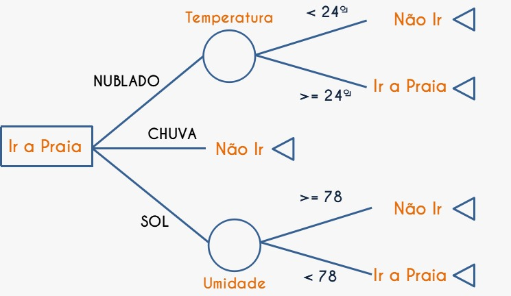

```{r setup, include=FALSE}
knitr::opts_chunk$set(echo = TRUE)
```

## Um breve introdução sobre árvores de decisão

```{r, echo=FALSE}

```

### O que é?

* É um modelo de aprendizagem de máquina supervisionado (supervised machine learning)

* Podem ser usados para problemas de regressão e classificação


### Estrutura de uma árvode de decisões

* __Raíz__: é o primeiro nó na hierarquia da árvore (nós de decisão)

* __Nó__: sãos os filho do nó raíz e representam decisões incertas (nós de probabilidade)

* __Nó folha (terminal)__: é o nó que não possui filhos e traz a decisão final (nó de desfecho)

Cada nó representa uma regra. O nó folha, por sua vez, representa a decisão a seguir no fluxo de decisões da árvore. 


## Libs

```{r}
# install.packages("rpart")
# install.packages("rpart.plot")
# install.packages("corrplot")
```


```{r}
library(tidyverse)
library(sf)
library(rpart)
library(rpart.plot)
```

## Importar os dados

```{r}
df <- read_sf('../dados/preparados/distritos_cultura.shp')
```

## Preparar dados para árvore

```{r}
1000/0
```

```{r}
df <- df %>% 
  mutate(negros = pretos + pardos,
         brancos1000 = brancos/1000,
         negros1000 = negros/1000,
         pessoas1000 = pessoas/1000,
         equipamentos_pc = (pessoas / eqpmnts) / 10000,
         equipamentos_pc =  ifelse(is.infinite(equipamentos_pc), 0, equipamentos_pc),
         y1 = factor(eqpmnts > mean(eqpmnts), labels = c("<= Média", "> Média")),
         y2 = factor(eqpmnts == 0, labels = c("0", "> 0")),
         y3 = factor(equipamentos_pc > mean(equipamentos_pc), labels = c("<= Média", "> Média"))
         )
```

```{r}
df %>% names
```

## Explorando os dados

```{r}
table(df$y1)
prop.table(table(df$y1))
```

```{r}
mean(df$eqpmnts)
```

```{r}
df %>%
  data.frame %>%
  select(contains("1000"), rnd_dm_, y1) %>% 
  group_by(y1) %>%
  summarise_all(funs(mean)) %>% 
  mutate_at(vars(-y1, -rnd_dm_, -pessoas1000), ~(. / sum(.))) %>% 
  pivot_longer(cols=-c(y1)) %>%
  pivot_wider(names_from = y1)
```

```{r}
df %>%
  data.frame %>%
  select(contains("1000"), rnd_dm_, bibltcs, y3) %>% 
  group_by(y3) %>%
  summarise_all(funs(mean)) %>% 
  mutate_at(vars(-y3, -rnd_dm_, -pessoas1000, -bibltcs), ~(. / sum(.))) %>% 
  pivot_longer(cols=-c(y3)) %>%
  pivot_wider(names_from = y3)
```

```{r}
correlations <- cor(df %>% data.frame %>% select(eqpmnts, equipamentos_pc, rnd_dm_, brancos, pretos))
knitr::kable(correlations)
```

```{r}
library(corrplot)
corrplot(correlations,
         method="color",  
         order="hclust",
         addCoef.col = "black", # Add coefficient of correlation
         tl.col="black" #Text label color and rotation
         )
```

## Árvore de decisões

### Árvore 1 - Buscando padrões

Explorar a relação entre a quantidade de pessoas negras por distrito como fato do distrito ter mais ou menos equipamentos culturais que a média municipal de equipamentos por distrito.


```{r}
freqs = table(df$y1)
freqs
```

```{r}
prop.table(freqs)
```


y = y1 (distritos tem ou não mais equipamentos que a média)
X = negros1000


```{r}
library(rpart)
library(rpart.plot)

fit <- rpart(y1 ~ negros1000, data=df,
             method="class", control = rpart.control(maxdepth=3, cp=-1))

rpart.plot(fit)
```

Cada nó apresenta:

- A classe estimada

- A probabilidade estimada

- O percentual de observações que caíram no nó

```{r}
df %>% select(negros1000)
```


```{r}
df$y1pred <- predict(fit, df %>% select(negros1000), type="class")
df$y1pred
```

```{r}
df %>%
  data.frame %>% 
  count(y1, y1pred)
```


### Árvore 2 - Buscando padrões

Explorar a relação entre a quantidade de renda domicilar e pessoas negras por distrito como fato do distrito ter mais ou menos equipamentos culturais per capita que a média municipal por distrito.


```{r}
mean(df$equipamentos_pc)
```

```{r}
freqs = table(df$y3)
freqs
```

```{r}
prop.table(freqs)
```


```{r}
library(rpart)
fit <- rpart(y3 ~ rnd_dm_ + negros1000, data=df,
             method="class", control = rpart.control(maxdepth=3, cp=-1))
rpart.plot(fit)
```

```{r}
df$y3pred <- predict(fit, df %>% select(rnd_dm_, negros1000), type="class")
```


```{r}
table(df$y3, df$y3pred)
```

```{r}
prop.table(table(df$y3, df$y3pred))
```


