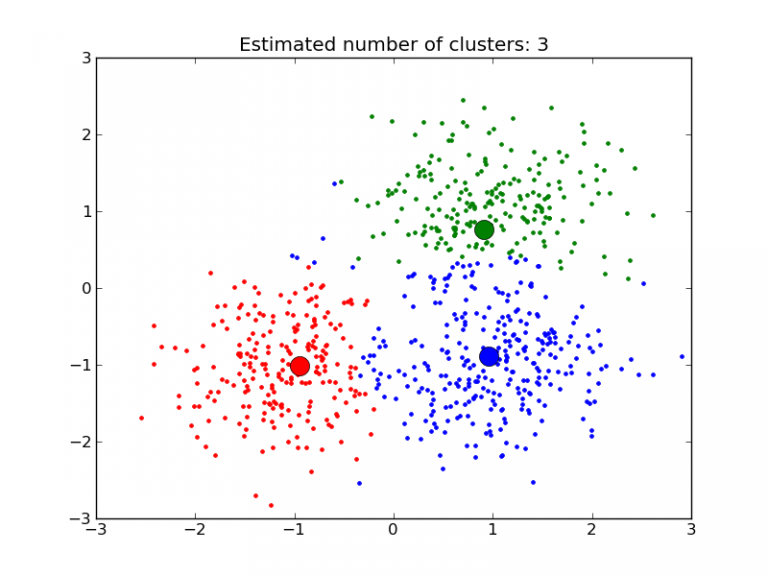

```{r setup, include=FALSE}
knitr::opts_chunk$set(echo = TRUE)
```

## Um breve introdução sobre clusterização

> Algoritmos de clusterização são utilizados na criação de modelos de aprendizagem não supervisionado.
>
> Diferentemente do caso de modelos supervisionados, os algoritmos não supervisionados não requerem um target observável. Isto é, não demandam uma variável resposta `y` para o treinamento do modelo
>
> Ao invés de buscar padrões em relação a uma resposta, eles identificam padrões nas estruturas dos dados e rotulam as observações de acordo com o agrupamento ao qual ela mais se assemelha

```{r, echo=FALSE}

```

## Libs e dados

```{r}
# install.packages("factoextra")
```

```{r}
library(tidyverse)
library(sf)
library(factoextra)
library(cluster)
```

```{r}
df <- read_sf('../dados/preparados/distritos_cultura.shp')
```


## Preparar dados para clusterizar

Primeiro vamos criar algumas variáveis:

```{r}
df <- df %>% 
  mutate(negros = pretos + pardos,
         equipamentos_pc = (pessoas / eqpmnts) / 10000,
         bibs_pc = (bibltcs / eqpmnts) / 10000,
         teatro_pc = (ttr_cnm / eqpmnts) / 10000,
         museus_pc = (museus / eqpmnts) / 10000,
         ec_pc = (espcs_c / eqpmnts) / 10000,
         pessoas_dom = pessoas / domicls
         )

df$bibs_pc[is.na(df$bibs_pc)] <- 0
df$teatro_pc[is.na(df$teatro_pc)] <- 0
df$museus_pc[is.na(df$museus_pc)] <- 0
df$ec_pc[is.na(df$ec_pc)] <- 0
df$equipamentos_pc[is.infinite(df$equipamentos_pc)] <- 0
```

No caso da clusterização é aconselhável usar antes duas outras técnicas: a primeira é reescalar os dados e a segunda é aplicar uma Principal Componente Analysis (PCA, ou Análise de Componentes Principais).

### Reescalar os dados

O que faremos é chamado de "padronização Z" ou __Z standardization__:

$$
Zscore = \frac{x - \mu}{\sigma}
$$

Em outras palavras:

Z-Score = (x - media(x)) / desvio padrao(x)

O que ela faz é centralizar os dados em torno da média, calculando a distância de cada em valor em relação à média em termos de desvio padrão.

Na prática, cada valor se tornará a distância do valor original até a média, em desvios padrões.

No R podemos facilmente reescalar os dados para o Z-Score com a função `scale()`.

```{r, fig.width=8, fig.height=6}
df %>% 
  data.frame %>% 
  select(brancos, pretos, amarels, pardos, indigns, pessoas_dom, rnd_dm_,
         contains("_pc")) %>%
  pivot_longer(cols=everything()) %>% 
  ggplot(aes(x = value, color = name)) + 
  geom_density(show.legend = FALSE) +
  facet_wrap(~name, scales = "free")
```


```{r, fig.width=8, fig.height=6}
X <- df %>% 
  data.frame() %>% 
  select(brancos, pretos, amarels, pardos, indigns, pessoas_dom, rnd_dm_,
         contains("_pc")) %>%
  scale() %>% 
  data.frame()

rownames(X) <- df$nm_dstr
X %>% 
  pivot_longer(cols=everything()) %>% 
  ggplot(aes(x = value, color = name)) + 
  geom_density() +
  facet_wrap(~name)
```

```{r}
map_df(df %>% data.frame %>% select(names(X)), ~c(min(.), max(.)), na.rm=TRUE)
map_df(X, ~c(min(.), max(.)), na.rm=TRUE)
```

### Análise de componentes principais

```{r}
X.pca <- prcomp(X)
summary(X.pca)
```

> * The center point ($center), scaling ($scale), standard deviation(sdev) of each principal component
> * The relationship (correlation or anticorrelation, etc) between the initial variables and the principal components ($rotation)
> * The values of each sample in terms of the principal components ($x)

#### Visualização de PCA (biplot)

```{r}
# remotes::install_github("vqv/ggbiplot")
library(ggbiplot)
```

```{r, fig.width=8, fig.height=7}
ggbiplot(X.pca) +
  theme_minimal()
```

```{r, fig.width=8, fig.height=7}
ggbiplot(X.pca, ellipse=TRUE, labels=rownames(X), groups = df$equip_groups) +
  theme_minimal()
```
## Reorganizar a refazer análise de PCA

```{r}
cols <- c("brancos", "negros_indios", "amarels", "pessoas_dom", "rnd_dm_",
          "bibs_pc", "teatro_pc", "ec_pc", "museus_pc")
X <- X %>%
  mutate(negros_indios = pretos + pardos + indigns) %>% 
  select(all_of(cols))
```

```{r, fig.width=8, fig.height=7}
X.pca <- prcomp(X)
ggbiplot(X.pca, ellipse=TRUE, labels=rownames(X), groups = df$equip_groups) +
  theme_minimal()
```
```{r}
fviz_eig(X.pca, addlabels = TRUE, ylim = c(0, 60))
```


## Clusterização

### Visualizar distâncias

```{r, fig.height=12, fig.width=8}
X.dist <- get_dist(X, stand = TRUE, method = "pearson")

fviz_dist(X.dist, 
   gradient = list(low = "#00AFBB", mid = "white", high = "#FC4E07"))
```

### Determinar o número ótimo de clusters

```{r}
fviz_nbclust(X, kmeans, method = "gap_stat")
```

### Clusterizar com Kmeans

```{r}
set.seed(123)
X.km <- kmeans(X, 6, nstart = 25)
```

### Visualizar clusters

```{r}
library("factoextra")
fviz_cluster(X.km, data = X,
             ellipse.type = "convex",
             palette = "jco",
             ggtheme = theme_minimal())
```

```{r, fig.width=8, fig.height=5}
df$cluster <- factor(X.km$cluster)
df %>% 
  data.frame %>% 
  group_by(cluster) %>% 
  mutate(cluster = as.numeric(as.character(cluster))) %>% 
  summarise_at(vars(contains("pc")), mean) %>% 
  pivot_longer(cols=c(-cluster)) %>% 
  mutate(cluster = factor(cluster)) %>% 
  ggplot(aes(x=cluster, y=value, fill=cluster)) +
  geom_bar(stat="identity") + 
  scale_fill_brewer(palette = "Set2") +
  facet_wrap(~name, scales="free")
```


```{r, fig.width=8, fig.height=7}
df %>% 
  ggplot(aes(fill = cluster)) +
  geom_sf(lwd=0.4, color="white") +
  scale_fill_brewer(palette = "Reds", direction = -1) +
  theme_minimal()
```

